# 🏗️ SpendSense AI — Architecture Documentation

> **Version:** 1.0.0 | **Last Updated:** July 2026 | **Stack:** React · Node.js · MongoDB · Groq AI

---

## 📋 Table of Contents

1. [System Architecture Overview](#1-system-architecture-overview)
2. [Frontend Architecture](#2-frontend-architecture)
3. [Backend Architecture](#3-backend-architecture)
4. [MongoDB Data Layer](#4-mongodb-data-layer)
5. [Groq AI Integration](#5-groq-ai-integration)
6. [AI Agents Registry](#6-ai-agents-registry)
7. [AI Orchestrator Pipeline](#7-ai-orchestrator-pipeline)
8. [Authentication Flow](#8-authentication-flow)
9. [Expense Flow](#9-expense-flow)
10. [AI Analysis Flow](#10-ai-analysis-flow)
11. [Notification System Flow](#11-notification-system-flow)
12. [Deployment Architecture](#12-deployment-architecture)

---

## 1. System Architecture Overview

SpendSense AI follows a **3-tier client-server architecture** with a dedicated AI intelligence layer powered by Groq's LLM API.

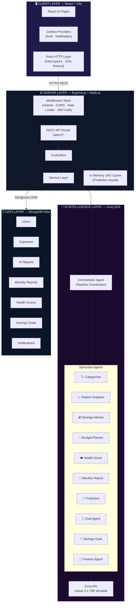

---

## 2. Frontend Architecture

### Component Tree & Data Flow

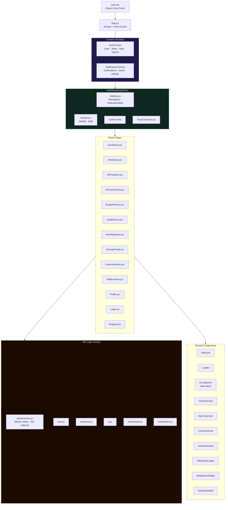

### State Management Strategy

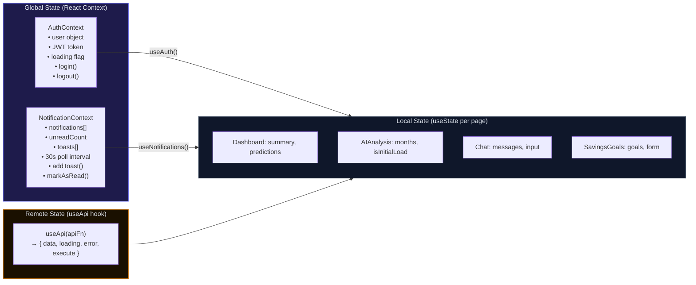

---

## 3. Backend Architecture

### Server & Middleware Stack

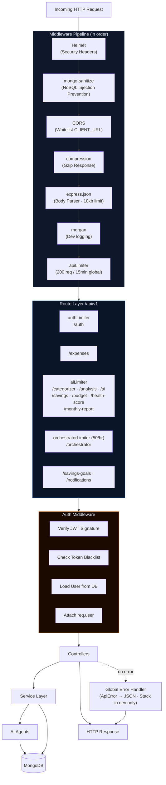

### Service Layer Responsibilities

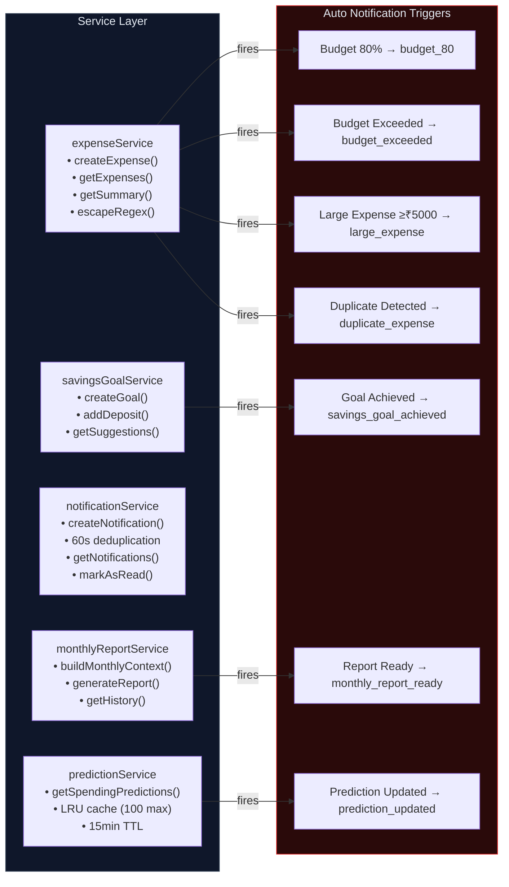

---

## 4. MongoDB Data Layer

### Schema Entity Relationship Diagram

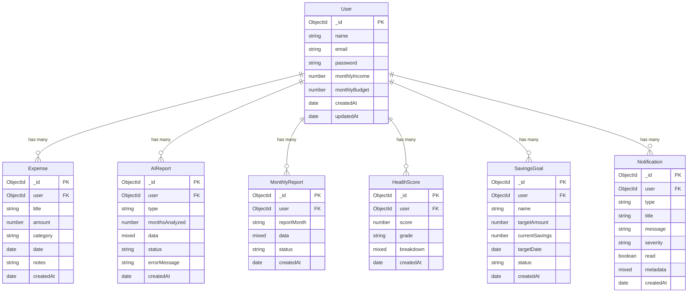

### Database Indexes

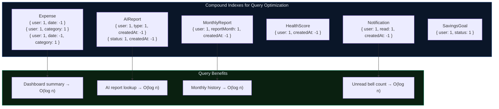

---

## 5. Groq AI Integration

### Groq SDK Configuration

```mermaid
graph LR
    subgraph CONFIG["Groq Client Config"]
        KEY["GROQ_API_KEY\n(env variable)"]
        MODEL["Model: llama-3.3-70b-versatile"]
        TIMEOUT["Timeout: 60,000ms"]
        RETRIES["Max Retries: 3"]
        TEMP["Temperature: 0.1–0.4\n(agent-specific)"]
    end

    subgraph PATTERN["Prompt Pattern"]
        SYS["System Prompt\n(Role + Output format)"]
        USER_P["User Prompt\n(Financial data context)"]
        FORMAT["Output Contract\n(Strict JSON only,\nno markdown fences)"]
    end

    subgraph SAFETY["Safety & Reliability"]
        PARSE["Safe JSON Parser\n(strip ```json fences)"]
        FALLBACK["Structured Fallback\n(returned on parse failure)"]
        LOG["Error Logging\n([AgentName] parse error)"]
    end

    CONFIG --> PATTERN --> SAFETY

    style CONFIG fill:#1a0a2e,stroke:#7c3aed,color:#e2e8f0
    style PATTERN fill:#0f172a,stroke:#334155,color:#e2e8f0
    style SAFETY fill:#0a2010,stroke:#059669,color:#e2e8f0
```

### Agent Temperature Strategy

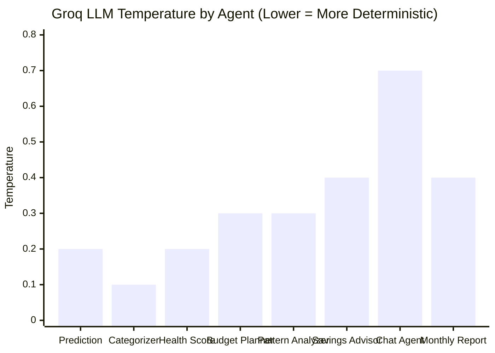

---

## 6. AI Agents Registry

### Agent Capabilities Map

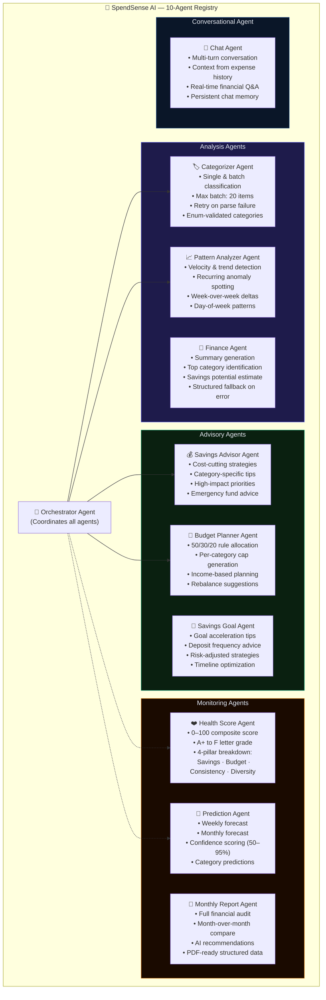

---

## 7. AI Orchestrator Pipeline

### 5-Stage Multi-Agent Pipeline

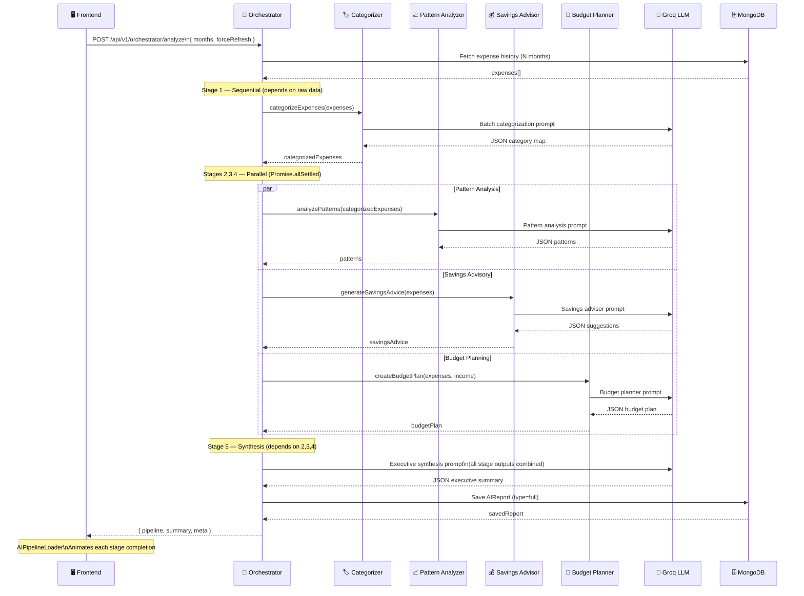

### Orchestrator Failure Isolation

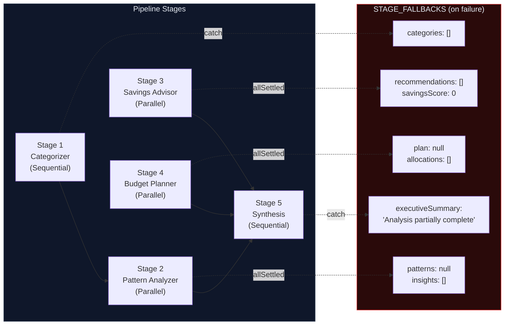

---

## 8. Authentication Flow

### Registration & Login

```mermaid
sequenceDiagram
    participant U as 👤 User
    participant FE as 🖥️ React App
    participant MW as ⚙️ Auth Middleware
    participant CTRL as 📋 AuthController
    participant DB as 🗄️ MongoDB

    rect rgb(30, 27, 75)
        Note over U,DB: REGISTRATION FLOW
        U->>FE: Fill register form\n(name, email, password)
        FE->>CTRL: POST /api/v1/auth/register
        CTRL->>DB: Check existing email
        DB-->>CTRL: null (not found)
        CTRL->>DB: bcrypt.hash(password, 12)
        CTRL->>DB: User.create({ name, email, hashedPassword\n  monthlyIncome: 3000, monthlyBudget: 2400 })
        DB-->>CTRL: newUser
        CTRL->>CTRL: user.generateToken() → JWT
        CTRL-->>FE: { user: toSafeObject(), token }
        FE->>FE: AuthContext.login(user, token)\nlocalStorage.setItem(token, user)
        FE-->>U: Redirect → /dashboard
    end

    rect rgb(10, 22, 40)
        Note over U,DB: LOGIN FLOW
        U->>FE: Fill login form\n(email, password)
        FE->>CTRL: POST /api/v1/auth/login
        CTRL->>DB: User.findOne({ email }).select(+password)
        DB-->>CTRL: user
        CTRL->>CTRL: user.comparePassword(plain)\nbcrypt.compare()
        CTRL->>CTRL: user.generateToken() → JWT
        CTRL-->>FE: { user: toSafeObject(), token }
        FE->>FE: AuthContext.login(user, token)
        FE-->>U: Redirect → /dashboard
    end
```

### JWT Authentication Middleware

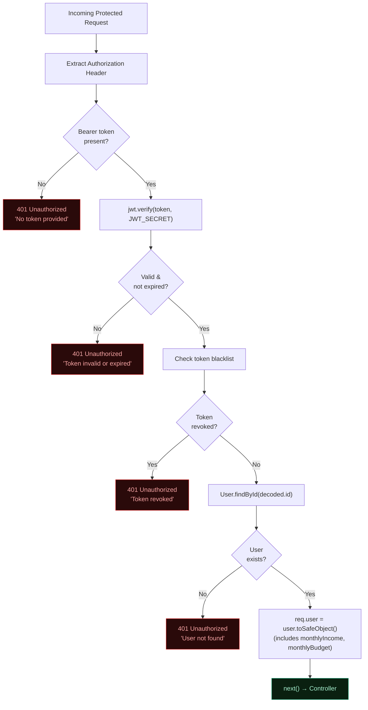

---

## 9. Expense Flow

### Add Expense — Complete Flow

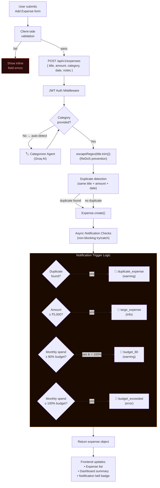

### Expense History Query Flow

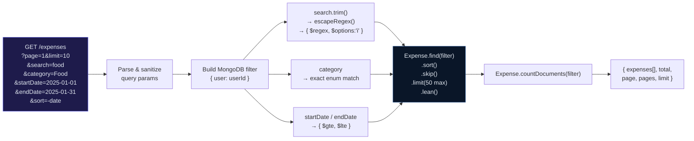

---

## 10. AI Analysis Flow

### Full Orchestrator Analysis Request

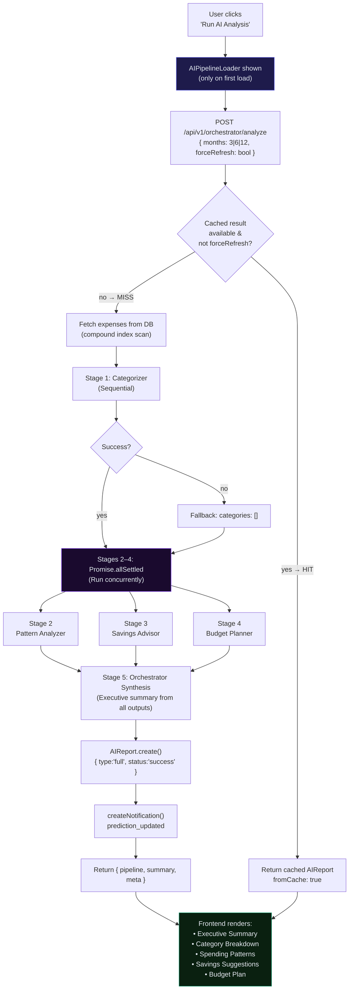

### AI Prediction Flow

```mermaid
flowchart LR
    REQ["GET /api/v1/ai/predictions\n?months=6&forceRefresh=false"]

    REQ --> LRU{"LRU Cache\nhit?\n(15min TTL\nmax 100 entries)"}
    LRU -->|"hit"| RET_CACHE["Return cached\n{ ...data, fromCache: true }"]
    LRU -->|"miss"| PARALLEL_AGG

    subgraph PARALLEL_AGG["4 Parallel MongoDB Aggregations"]
        AGG1["Totals Aggregation\ntotalSpent · count · avg"]
        AGG2["Category Breakdown\nper-category total · count"]
        AGG3["Weekly Grouping\nisoWeek past 4 weeks"]
        AGG4["Day-of-Week Pattern\navg spend per weekday"]
    end

    PARALLEL_AGG --> CONTEXT["Build prediction context\n{ avgWeekly · avgMonthly · categories\n  normalizedWeeks[4] · dailyPattern }"]

    CONTEXT --> PRED_AGENT["🔮 Prediction Agent\n(Groq · temp=0.2)"]
    PRED_AGENT --> CONFIDENCE["Dynamic confidence score\n+10 if txns≥10\n+10 if txns≥30\n+5 if months≥3\n+5 if months≥6\n→ clamp(50, 95)"]

    CONFIDENCE --> SET_CACHE["setCached(key, result)\n(evict oldest if size≥100)"]
    SET_CACHE --> RETURN["Return predictions\n{ nextWeek · nextMonth · forecastSeries\n  categoryPredictions · confidence }"]

    style PARALLEL_AGG fill:#0a1628,stroke:#1e4d8c,color:#e2e8f0
    style PRED_AGENT fill:#1a0a2e,stroke:#7c3aed,color:#e2e8f0
```

---

## 11. Notification System Flow

### End-to-End Notification Lifecycle

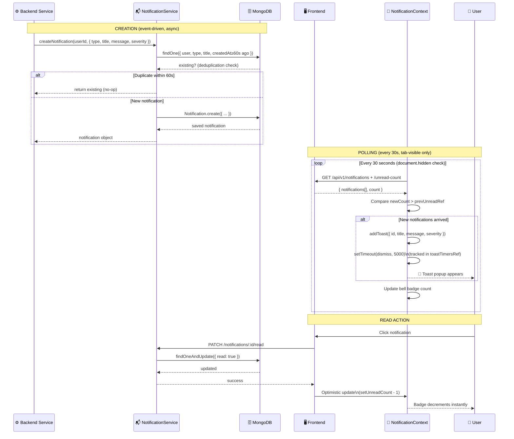

---

## 12. Deployment Architecture

### Production Deployment Topology

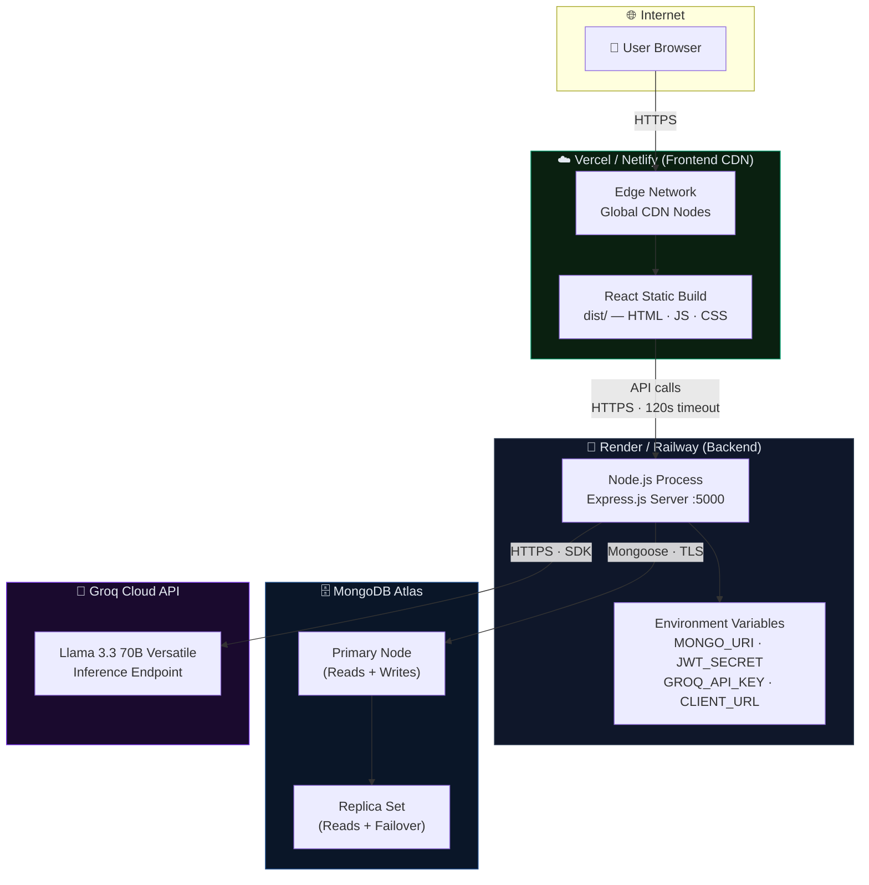

### Environment Variables Reference

| Variable | Service | Required | Description |
|---|---|---|---|
| `MONGO_URI` | Backend | ✅ | MongoDB Atlas connection string |
| `JWT_SECRET` | Backend | ✅ | Secret key for JWT signing (min 32 chars) |
| `JWT_EXPIRES_IN` | Backend | ⚪ | Token expiry (default: `7d`) |
| `GROQ_API_KEY` | Backend | ✅ | Groq cloud API key |
| `GROQ_MODEL` | Backend | ⚪ | LLM model (default: `llama-3.3-70b-versatile`) |
| `GROQ_TIMEOUT_MS` | Backend | ⚪ | Groq request timeout ms (default: `60000`) |
| `GROQ_MAX_RETRIES` | Backend | ⚪ | Groq retry count (default: `3`) |
| `CLIENT_URL` | Backend | ✅ | Frontend URL for CORS whitelist |
| `PORT` | Backend | ⚪ | Server port (default: `5000`) |
| `NODE_ENV` | Backend | ⚪ | `development` or `production` |
| `VITE_API_BASE_URL` | Frontend | ✅ | Backend API base URL |

---

## Appendix — API Rate Limits

| Route Group | Limiter | Window | Max Requests |
|---|---|---|---|
| Global `/api` | `apiLimiter` | 15 min | 200 |
| `/auth` | `authLimiter` | 15 min | 20 |
| `/ai/*` routes | `aiLimiter` | 60 min | 200 |
| `/orchestrator` | `orchestratorLimiter` | 60 min | 50 |

> **Note:** All rate limiters are bypassed in `development` mode (`NODE_ENV !== 'production'`) via passthrough middleware.

---

*Generated for SpendSense AI — AgentVerse Grand Challenge 2026*
